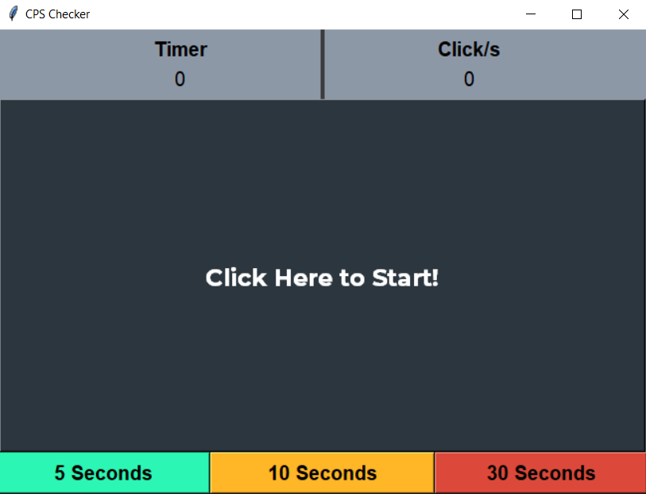
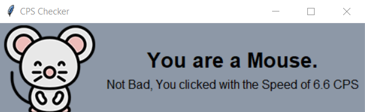

# CPSChecker
A Program made to test Clicks Per Second. Made using Tkinter and Python

## Installation For Source Code
1. Clone This Repository to your machine
2. Install Pillow Module using CMD
```pip install Pillow```
3. Done!

## Just Want to Play around with the Software?
Download cpsgame.rar in the build folder, extract it and launch cpsgame.exe!

## Screenshot of the Software:-


